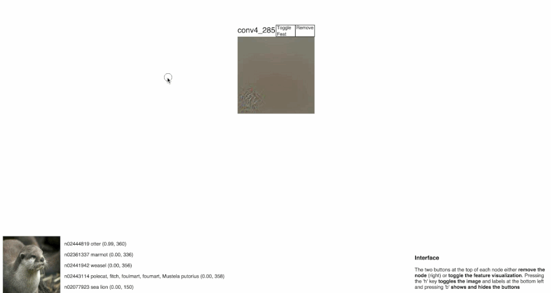

release TODOs
===

* finish README

---

This is a pre-alpha quality release of visualization software for Convolutional Neural Networks (CNNs).
Its goal is to help the user understand the hierarchy of parts encoded by a CNN through
visualization of the parts and their relation to existing low and high level intutions.

Setting Up and Running the Server
===

1. Setup directories and leave a pointer to the imagenet val set (see `setup.sh`).

        $ git clone --recursive git@github.com:mcogswell/cnn_treevis.git
        $ cd cnn_treevis/
        $ ./setup.sh  # set your own IMNET_VAL_LMDB

2. Build caffe with python support (http://caffe.berkeleyvision.org/installation.html).
   Make sure the python module is importable from the cloned directory.

        $ cd caffe/
        $ make all py  # do NOT use CuDNN! (see TODOs below)
        $ export PYTHONPATH=$PYTHONPATH:./caffe/python/  # allow importing caffe from the cloned directory

3. Cache feature visualizations. This step can take a long
   time (a couple hours), but you can make it closer to an hour
   if you have multiple GPUs. To do so see the note at the
   top of the script.

        $ ./scripts/cache_features_caffenet_imnet_val.sh

4. To run the server:

        $ python app.py caffenet_imnet_val --gpu-id <id>

5. Try the visualization: go to [http://localhost:5000/gallery](http://localhost:5000/gallery) in your browser and start exploring.

Application Overview
===

Typical flow

1. open gallery

2. pick an image

3. pick an interesting neuron

4. click on leaf nodes to see how they relate to 

NOTE: This interface could be a lot better. Let me know if you have ideas or
time to work on it.

Frontend Components
===

The main vis is in templates/vis.html.

The other pages... TODO

Backend Components
===

Visualization components are served from a [Flask](http://flask.pocoo.org/) app.
This interacts with a dynamic component which generates example-specific
visualization components and a static/cached component which serves network-specific
components.

Flask App
---
This serves each page in the interface as well as the visualization components within a page.
Each page/component is retrieved through a separate HTTP request.

TODO: detail web api here or lower in the page

Dynamic Vis Generator
---
All of the Zeiler/Fergus or Guided Backprop based images are generated at
runtime. Each vis page is associated with a `VisTree` instance (`lib/recon/reconstruct.py`) 
which stores and computes vis components for one image.

Cached Vis Generator
---
Some parts of the application are generated before runtime and cached
as static content. Currently, this only includes neuron-wise visualizations,
which must be generated offline with a command line utility.

TODOs
===

* Figure out a better way of re-weighting gradients filtered through a vis path.
  Right now expanding the hierarchy from fc8 to conv1 leads to oversaturated
  images deeper in the tree. There should be a way to adjust gradient magnitudes
  to prevent oversaturation.

* (Bug) Note that caffe must be build without CuDNN support or the ReLU needs to
  be changed to use my implementation. A better way to implement this would
  be in the fashion of yosinski's deconv implementation.

* Allow drilling up in the hierarchy as well as drilling down.

* Implement efficient batch computation. Have VisTree run an event loop.
  Whenever a feature vis is requested it enqueues its path
  and waits for that vis to be computed. Each job in the event loop
  dequeues a whole batch from the queue and runs it. Once a specific path's
  job gets to execute it's likely to have already been handled by some other
  job, so it doesn't have to do any work. Tricky, but fun... use asyncio

* Make both net and image context apparent in URL. There should also be a way to
  select a network from a list of networks that can be visualized.

* Clean up FeatBuilder code.
